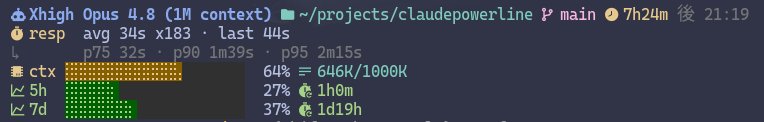

# claudepowerline

ayangd's Claude Code statusline — a fast, multi-line status line in Rust. It reads
Claude Code's status-line JSON on stdin and prints an ANSI-rendered status block.

## What it shows



- **Line 1** — model · cwd (`~`-shortened) · git branch · elapsed · last message (local `HH:MM`)
- **Lines 2–3** — agent response latency: `avg`/`last` over `x<n>` responses, plus `p75/p90/p95`
- **Line 4** — context window: usage bar + `in+out K / limit K` tokens
- **Lines 5–6** — usage window: 5h / 7d utilization + reset countdown

Values that aren't available yet render as `—` (e.g. on the first turn).

## Requirements

The icons and the braille usage bars are [Nerd Font](https://www.nerdfonts.com/)
glyphs. **Your terminal must be configured with a Nerd Font** (e.g. *JetBrainsMono
Nerd Font*, *FiraCode Nerd Font*) — otherwise the icons render as missing or "tofu"
boxes (□). The text, colors, bars, and numbers still work without it; only the
glyph icons need the patched font.

## Develop

Nix flake + direnv:

```bash
direnv allow                    # or: nix develop "path:$PWD"
cargo build
cargo test                      # lib unit tests + golden snapshots
cargo clippy --all-targets
```

Golden snapshots live in `tests/golden/`; refresh them with
`UPDATE_GOLDEN=1 cargo test --test golden`.

## Install

### Nix (Linux / macOS)

```bash
nix build "path:$PWD#default"   # builds ./result (a GC-rooted symlink)

# wire it into settings.json — resolves the path, merges via jq (keeps everything else):
tmp=$(mktemp)
jq --arg cmd "$PWD/result/bin/claudepowerline" \
   '.statusLine = {type: "command", command: $cmd, padding: 0}' \
   ~/.claude/settings.json > "$tmp" && mv "$tmp" ~/.claude/settings.json
```

`result` tracks your latest build, so re-running `nix build "path:$PWD#default"` after a
change updates the live status line. To revert, point `statusLine.command` back at your
previous script.

### Windows

No Nix — build with [rustup](https://rustup.rs/) and point `settings.json` at the
`.exe`. Needs Git for Windows on `PATH` and a Nerd Font terminal (e.g. Windows
Terminal). From the repo in PowerShell:

```powershell
cargo build --release
$cmd = (Resolve-Path .\target\release\claudepowerline.exe).Path
$f   = "$env:USERPROFILE\.claude\settings.json"
$j   = Get-Content $f -Raw | ConvertFrom-Json
$j | Add-Member statusLine ([pscustomobject]@{ type = 'command'; command = $cmd; padding = 0 }) -Force
$j | ConvertTo-Json -Depth 32 | Set-Content $f
```

PowerShell's `ConvertTo-Json` rewrites the whole file (jq preserves formatting
better), so back up `settings.json` first if its layout matters to you.

## Side effects

Claude Code runs the command on every status-line update. Per run it may:

- **Write one file** — `~/.claude/cache/usage-window.json` (creating `~/.claude/cache/`
  if needed): a small JSON cache of the 5h/7d usage percentages and reset timestamps,
  written ~once a minute when the cache goes stale and a usage fetch succeeds. **The OAuth
  token is never written to it.** This is the *only* file the program writes.
- **Make one network request** — `GET https://api.anthropic.com/api/oauth/usage`, at most
  once per minute (the cache TTL), sending the token from `~/.claude/.credentials.json` as a
  `Bearer` header (5 s timeout). Skipped while the cache is fresh; any failure falls back to
  the cache or just hides the usage rows.
- **Run `git`** (read-only) — `git -C <cwd> branch --show-current`, plus `rev-parse --short
  HEAD` when detached. It never modifies the repo.
- **Read** — stdin, the transcript file Claude Code points to, `~/.claude/.credentials.json`
  (the token), and the usage cache.

It never modifies your project, repository, or `settings.json`.

## Layout

Impure data-gathering is separated from pure rendering, so the renderer can be
golden-tested deterministically — and no credential (the OAuth token used for the
usage window) ever reaches the output.

- `gather.rs` — orchestrates `input` → `git` / `transcript` / `usage` → `StatusData`
- `render.rs` — pure `StatusData` → ANSI string
- `text.rs` — formatting / truncation helpers · `theme.rs` — palette, icons, bar geometry
- `data.rs` — display structs · `input.rs` — stdin JSON shape
- `git.rs` · `transcript.rs` · `usage.rs` — the impure sources
- `main.rs` — `stdin → gather_from_json → render → stdout`

Built with `serde`, `chrono`, and `ureq`.
